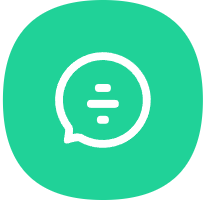

[中文](README.md) | [ENGLISH](README.en.md)

	

<h1 align="center" style="margin: 30px 0 30px; font-weight: bold;">Zoey Chat v1.0.0</h1>
<h4 align="center">Chat server based on SpringBoot3.2, including chat services developed by Redis, Mysql8.0, Docker, Jenkins, WebSocket and other related technologies</h4>

	
	

Continuously updated. . .@sxgan

All resources come from public resources on the Internet and are for learning only

## PLATFORM INTRODUCTION

## BUILT IN FUNCTIONS

## DEMONSTRATION DIAGRAM
